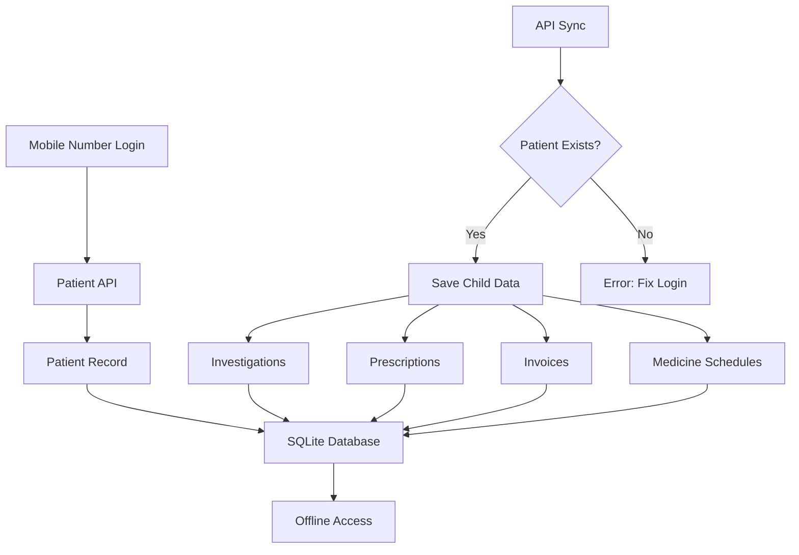
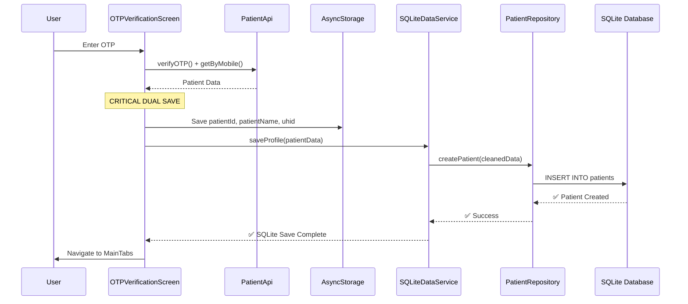
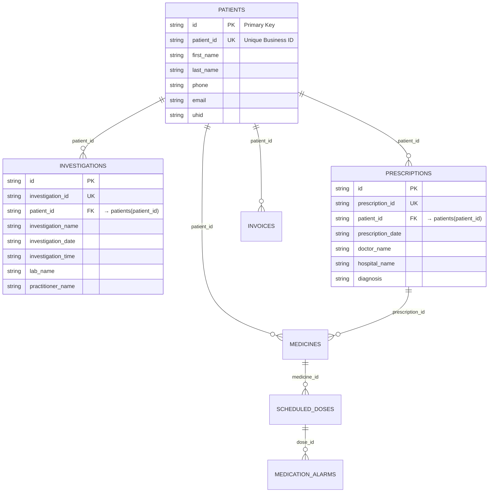
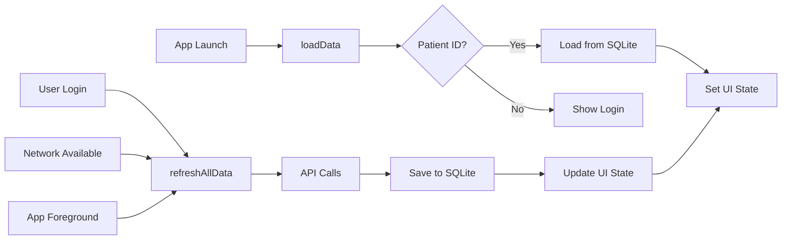
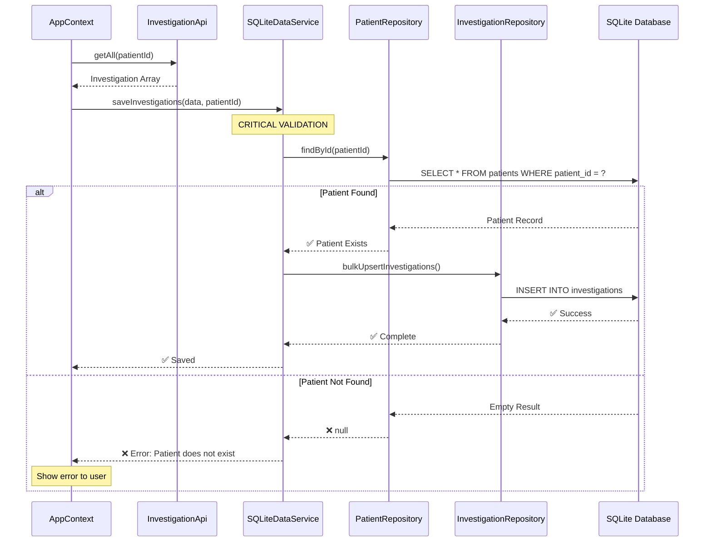
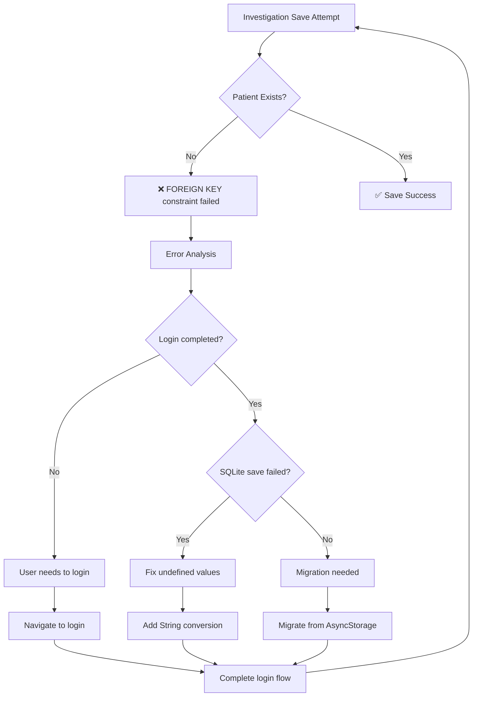
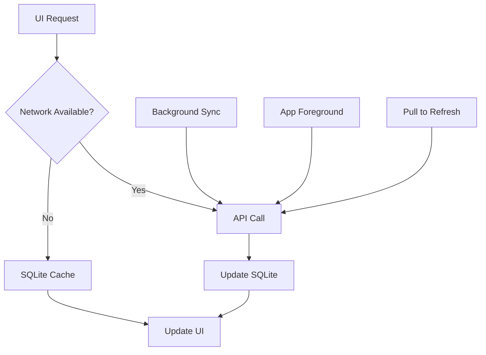

# SQLite Data Flow Architecture - Complete Design

## Overview

This document outlines the complete SQLite data flow architecture for the SmartCare mobile application. The system follows a **Patient-Centric Offline-First** approach where all data is scoped to individual patients and cached locally for offline access.

---

## 1. HIGH-LEVEL ARCHITECTURE



**Key Principle**: Patient record MUST exist in SQLite before any child data can be saved.

---

## 2. LOGIN FLOW - Patient Entry Point

### 2.1 Login Sequence Diagram



### 2.2 Expected Login Outcomes

| Step | File | Action | Expected Result |
|------|------|--------|----------------|
| 1 | `OTPVerificationScreen.jsx` | Get patient from API | Patient object with id=885 |
| 2 | Same | Save to AsyncStorage | `patientId: "885"` stored |
| 3 | Same | Call `sqliteDataService.saveProfile()` | Trigger SQLite save |
| 4 | `SQLiteDataService.js` | Route to PatientRepository | Data validation |
| 5 | `PatientRepository.js` | Clean undefined values | All fields are strings/null |
| 6 | Same | Execute INSERT | Patient record in `patients` table |
| 7 | `db.js` | SQLite INSERT | `patient_id: "885"` exists |

### 2.3 Login Success Criteria

✅ **Patient exists in AsyncStorage**: `await AsyncStorage.getItem('patientId')` returns "885"  
✅ **Patient exists in SQLite**: `SELECT * FROM patients WHERE patient_id = '885'` returns 1 row  
✅ **No undefined values**: All patient fields are valid strings or null  
✅ **Console logs show**: `[OTP] ✅ Patient saved to SQLite successfully`  

---

## 3. DATABASE SCHEMA - Parent-Child Relationships

### 3.1 Entity Relationship Diagram



### 3.2 Dual-ID Pattern

**Every table uses the Dual-ID Pattern:**

| ID Type | Purpose | Example | Usage |
|---------|---------|---------|-------|
| `id` | Primary Key (Internal) | `"pat_123456_abc"` | SQLite internal operations |
| `patient_id` | Business Key (External) | `"885"` | API references, queries |
| `investigation_id` | Business Key | `"inv_789"` | API references, queries |
| `prescription_id` | Business Key | `"rx_456"` | API references, queries |

**Rule**: All foreign keys reference business IDs, not primary keys.

---

## 4. APP CONTEXT - Data Synchronization Hub

### 4.1 App Context Data Flow



### 4.2 AppContext Methods Flow

| Method | Trigger | Data Source | Data Destination | Expected Outcome |
|--------|---------|-------------|------------------|------------------|
| `loadData()` | App launch | SQLite | UI State | Instant offline display |
| `refreshAllData()` | Login, network return, app foreground | API | SQLite + UI State | Fresh data cached |
| `saveProfile()` | Profile update | Form data | SQLite | Patient data updated |
| `saveInvestigations()` | API sync | API response | SQLite | Investigations cached |

### 4.3 AppContext Success Criteria

✅ **loadData()**: Reads cached profile + investigations from SQLite instantly  
✅ **refreshAllData()**: Syncs API → SQLite → UI without errors  
✅ **Offline mode**: UI shows cached data when network unavailable  
✅ **Online mode**: Fresh API data replaces cached data  

---

## 5. INVESTIGATION FLOW - Child Data Validation

### 5.1 Investigation Save Sequence



### 5.2 Investigation Validation Logic

| Check | File | Method | Success Case | Failure Case |
|-------|------|--------|--------------|--------------|
| 1. Patient ID provided | `SQLiteDataService.js` | `saveInvestigations()` | patientId = "885" | Throw error |
| 2. Patient exists in SQLite | Same | Call `patientRepo.findById()` | Returns patient record | Returns null |
| 3. Foreign key valid | `InvestigationRepository.js` | `bulkUpsertInvestigations()` | FK constraint passes | FK constraint fails |
| 4. Data saved | Same | Individual `upsert()` calls | Each investigation saved | Database error |

### 5.3 Investigation Success Criteria

✅ **Patient validation**: `SELECT * FROM patients WHERE patient_id = '885'` returns record  
✅ **Foreign key success**: `INSERT INTO investigations` completes without FK errors  
✅ **Data integrity**: All investigations reference correct `patient_id`  
✅ **Console logs show**: `[SQLiteDataService] ✅ Patient exists, proceeding with investigation save`  

---

## 6. ERROR SCENARIOS - Problem Resolution

### 6.1 Common Error Flow



### 6.2 Error Messages & Solutions

| Error Message | Root Cause | File Involved | Solution |
|---------------|------------|---------------|----------|
| `FOREIGN KEY constraint failed` | Patient doesn't exist in SQLite | `SQLiteDataService.js` | Complete login flow |
| `Cannot convert "undefined" to any type` | Undefined values in patient data | `PatientRepository.js` | Add String() conversion |
| `Patient 885 does not exist in SQLite` | Login SQLite save failed | `OTPVerificationScreen.jsx` | Check login error logs |
| `table has no column named X` | Schema mismatch | `db.js` | Add missing columns |

### 6.3 Recovery Strategies

**Strategy 1: Logout + Login**
```
User Action → Settings → Logout → Login again
Result → Fresh SQLite patient save
Expected → All errors resolved
```

**Strategy 2: AsyncStorage Migration**
```
Detection → Patient in AsyncStorage but not SQLite
Action → Automatic migration on first save attempt  
Result → Patient copied AsyncStorage → SQLite
```

**Strategy 3: Fresh Install**
```
Action → Uninstall + Reinstall app
Result → Clean database with fixed schema
Expected → No legacy data conflicts
```

---

## 7. OFFLINE-FIRST ARCHITECTURE

### 7.1 Data Access Hierarchy



### 7.2 Cache Strategy

| Data Type | Online Source | Cache Location | Cache Duration | Offline Behavior |
|-----------|---------------|----------------|----------------|------------------|
| Patient Profile | `PatientApi.getByMobile()` | SQLite `patients` table | Until next sync | Show cached profile |
| Investigations | `InvestigationApi.getAll()` | SQLite `investigations` table | Until next sync | Show cached list |
| Prescriptions | `PrescriptionApi.getAll()` | SQLite `prescriptions` table | Until next sync | Show cached list |
| Medicine Schedule | Computed from prescriptions | SQLite medication tables | Real-time updates | Show cached schedule |

### 7.3 Offline Success Criteria

✅ **Profile visible**: Patient can view their profile without network  
✅ **Investigations visible**: Past investigations display from cache  
✅ **Medicine schedule works**: Alarms and reminders function offline  
✅ **Data sync on reconnect**: Fresh data updates cache when network returns  

---

## 8. FILE RESPONSIBILITIES

### 8.1 Core Files & Responsibilities

| File | Layer | Responsibility | Key Methods |
|------|-------|----------------|-------------|
| `OTPVerificationScreen.jsx` | UI | Login + patient creation | `handleVerify()` |
| `AppContext.jsx` | State | Data orchestration | `refreshAllData()`, `loadData()` |
| `SQLiteDataService.js` | Service | Business logic | `saveProfile()`, `saveInvestigations()` |
| `PatientRepository.js` | Repository | Patient data access | `createPatient()`, `findById()` |
| `InvestigationRepository.js` | Repository | Investigation data access | `bulkUpsertInvestigations()` |
| `db.js` | Database | Schema + connection | `createInitialSchema()`, `migrateToV2()` |

### 8.2 Data Flow Layers

```
┌─────────────────────┐
│        UI Layer     │ ← InvestigationsScreen, ProfileScreen
├─────────────────────┤
│     State Layer     │ ← AppContext (React Context)
├─────────────────────┤
│    Service Layer    │ ← SQLiteDataService
├─────────────────────┤
│  Repository Layer   │ ← PatientRepository, InvestigationRepository  
├─────────────────────┤
│   Database Layer    │ ← db.js, BaseRepository
└─────────────────────┘
```

**Rule**: Each layer only communicates with adjacent layers, never skips.

---

## 9. TESTING SCENARIOS

### 9.1 Happy Path Test Flow

```
1. Fresh Install
   → Uninstall app
   → npm run android
   → Expected: Clean database, no cached data

2. Login
   → Enter mobile number + OTP
   → Expected: Patient saved to both AsyncStorage + SQLite
   → Verify: Console shows "[OTP] ✅ Patient saved to SQLite successfully"

3. Data Sync
   → Navigate to investigations
   → Expected: API data syncs to SQLite without foreign key errors  
   → Verify: Investigations appear in list

4. Offline Test
   → Close app
   → Disable network
   → Open app
   → Expected: Cached data displays instantly
   → Verify: Profile + investigations visible from SQLite

5. Online Sync
   → Enable network
   → Pull to refresh
   → Expected: Fresh API data updates cache
   → Verify: New investigations appear
```

### 9.2 Error Path Test Flow

```
1. Missing Patient Test
   → Manually delete patient from SQLite
   → Try to save investigations
   → Expected: Clear error message about missing patient
   → Verify: No app crash, helpful error message

2. Undefined Values Test  
   → Send patient data with undefined fields
   → Expected: Values converted to strings/null
   → Verify: No "Cannot convert undefined" errors

3. Schema Migration Test
   → Install old version
   → Add data
   → Upgrade to new version
   → Expected: Data preserved, schema upgraded
   → Verify: No data loss, new features work
```

---

## 10. SUCCESS CRITERIA CHECKLIST

### 10.1 Login Flow Success
- [ ] Patient API returns data
- [ ] AsyncStorage save completes  
- [ ] SQLite save completes without errors
- [ ] Console shows success message
- [ ] Patient exists in SQLite: `SELECT * FROM patients WHERE patient_id = 'X'`

### 10.2 Investigation Flow Success  
- [ ] Patient validation passes
- [ ] No foreign key constraint errors
- [ ] All investigations saved to SQLite
- [ ] Data visible in UI
- [ ] Console shows "[SQLiteDataService] ✅ Patient exists, proceeding..."

### 10.3 Offline Mode Success
- [ ] App launches without network
- [ ] Profile displays from SQLite cache
- [ ] Investigations display from SQLite cache
- [ ] No "network required" errors
- [ ] Data updates when network returns

### 10.4 Data Integrity Success
- [ ] No duplicate patients
- [ ] All investigations reference valid patient_id
- [ ] No orphaned records
- [ ] Foreign key constraints enforced
- [ ] Data survives app restart

---

## 11. MONITORING & DEBUGGING

### 11.1 Key Log Messages

**Success Indicators:**
```
✅ [OTP] ✅ Patient saved to SQLite successfully
✅ [AppContext] ✅ Patient profile saved to SQLite  
✅ [SQLiteDataService] ✅ Patient exists, proceeding with investigation save
✅ [InvestigationRepository] Found X investigations
```

**Error Indicators:**
```
❌ [OTP] ⚠️ Failed to save patient to SQLite: [error]
❌ [SQLiteDataService] ❌ CRITICAL: Patient not found in SQLite!
❌ FOREIGN KEY constraint failed
❌ Cannot convert "undefined" to any type
```

### 11.2 Debug Commands

**Check Patient Exists:**
```sql
SELECT patient_id, first_name, last_name FROM patients;
```

**Check Investigation Count:**
```sql
SELECT COUNT(*) FROM investigations WHERE patient_id = '885';
```

**Check Foreign Key Integrity:**
```sql
PRAGMA foreign_key_check;
```

---

## CONCLUSION

This SQLite data flow architecture ensures:
1. **Patient-centric data organization** - All data scoped to patients
2. **Offline-first functionality** - App works without network  
3. **Data integrity** - Foreign keys prevent orphaned records
4. **Robust error handling** - Clear error messages and recovery paths
5. **Scalable design** - Easy to add new data types

The system follows a strict **Parent → Child** hierarchy where patients must exist before any associated data can be saved, ensuring referential integrity and preventing the foreign key constraint errors that were occurring previously.
